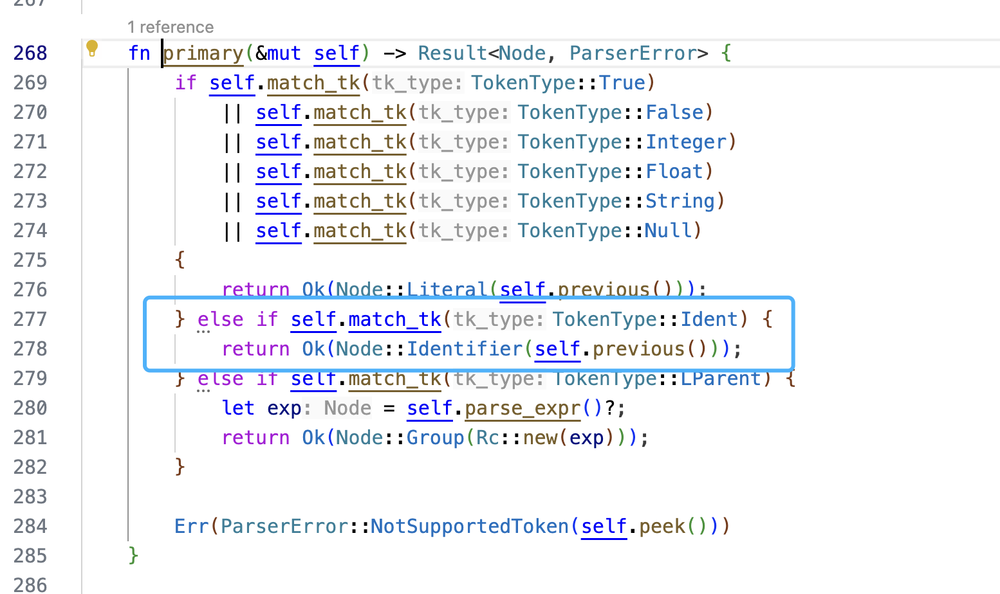

## Eval Identifier

```sh
>>>var x  = 123
tokens: Ok([Var, Ident("x"), Assign('='), Integer(123), EOF])
program: Ok(Program { stmts: [VarStmt(VarStmt { name: Ident("x"), value: Literal(Integer(123)) })] })
123
>>>x
tokens: Ok([Ident("x"), EOF])
program: Ok(Program { stmts: [Identifier(Ident("x"))] })
123
>>>var y = 456;
tokens: Err(InvalidToken(';'))
lexer err: ;
>>>var y = 456
tokens: Ok([Var, Ident("y"), Assign('='), Integer(456), EOF])
program: Ok(Program { stmts: [VarStmt(VarStmt { name: Ident("y"), value: Literal(Integer(456)) })] })
456
>>>x + y
tokens: Ok([Ident("x"), Plus('+'), Ident("y"), EOF])
program: Ok(Program { stmts: [Binary(Identifier(Ident("x")), Plus('+'), Identifier(Ident("y")))] })
579
```

### Parser



### Eval

```rust
fn eval_identifier(&mut self, tk: Token) -> Result<Object, EvalError> {
        match tk {
            Token::Ident(ident) => {
                if let Some(v) = self.get_value(ident.clone()) {
                    return Ok(v.clone());
                } else {
                    return Err(EvalError::IdentNotFound(ident));
                }
            }
            _ => Err(EvalError::NotIdent(tk)),
        }
}
```

```rust
pub fn eval(&mut self, node: Node) -> Result<Object, EvalError> {
        match node {
          ...
          Node::Identifier(x) => self.eval_identifier(x),
          ...
          _ => Err(EvalError::UnknowNode(node)),
        }
    }
```
