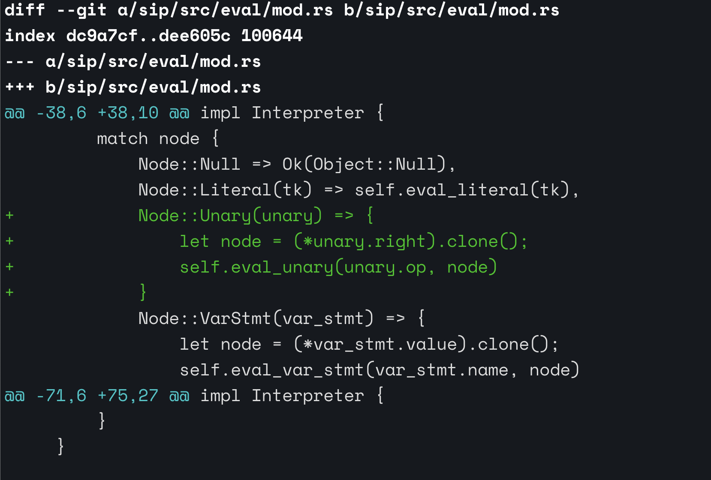
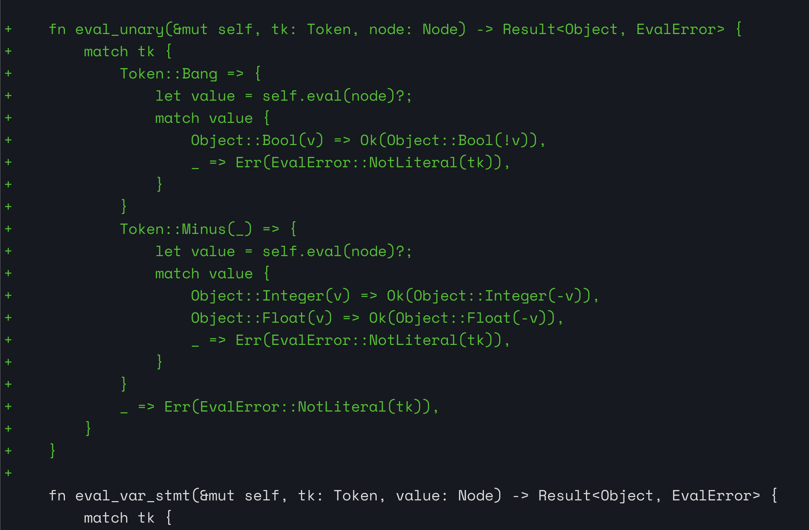

## Eval Unary

```sh
>>>-123
tokens: Ok([Minus('-'), Integer(123), EOF])
program: Ok(Program { stmts: [Unary(Unary { op: Minus('-'), right: Literal(Integer(123)) })] })
-123
>>>!true
tokens: Ok([Bang, True, EOF])
program: Ok(Program { stmts: [Unary(Unary { op: Bang, right: Literal(True) })] })
false
>>>!false
tokens: Ok([Bang, False, EOF])
program: Ok(Program { stmts: [Unary(Unary { op: Bang, right: Literal(False) })] })
true

```

## Eval



